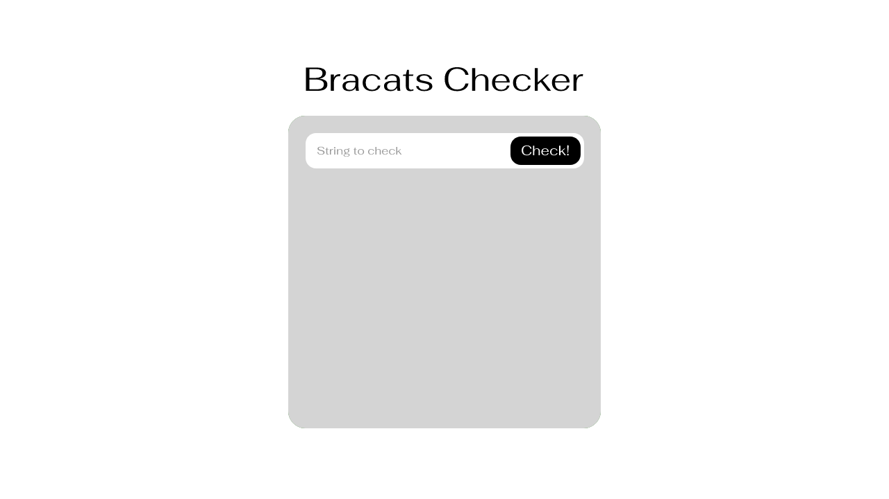
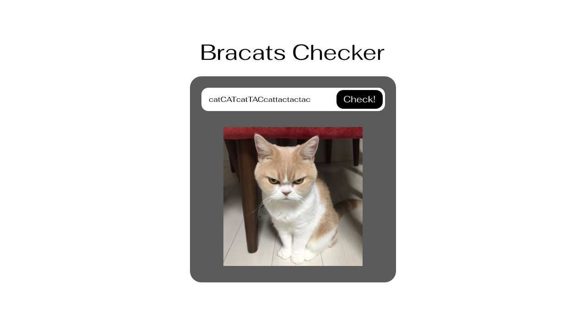

Bracats Checker
===============

Overview
--------

The purpose of this repository is to check skills of candidates applying to Orba for a position of Frontend Developer.
If you are here, you probably want to work with us :-).

Bracats Checker is a simple application built using JavaScript ES6 and jQuery.
It allows user to input a string of brackets and check if the order of brackets is valid.

- Instead of using classic brackets (`(`, `)`, `[`, `]`, `{`, `}`), application is using special "cat" brackets (aka "Bracats"): `cat`, `tac`, `CAT`, `TAC`, `cAt`, `tAc`.
- A string of brackets is considered valid if all open brackets are matched with their corresponding closed bracket. For example: `cattacCATTACcAttAc` and (`CATcattacTAC`) would be considered valid, while `catTAC`, `cAtcattActac` and `catcatcattactac` would be considered invalid.
- An empty string is considered valid.

In current state the application is correctly set up, but implemented algorithm is wrong.

### Mockups

#### Default view

#### Correct string view

#### Incorrect string view

Recruitment task description
----------------------------

1. Fork this repository.
2. Install application locally.
3. Implement Bracats validation in `check` method placed in `public/js/check.js` file.
4. Apply frontend changes so the application looks like on mockups. PSD file with the whole design can be found in `docs/project.psd`. Apply your own proposal for focus and hover effects style.
5. Don't worry about older browsers. Your solution should support newest Firefox and Chrome.
6. Write unit tests to get more points. Two of them are already in `tests/check.test.js` file.
7. Make your code SOLID to get even more points.
8. (Optional) For bonus points, set up webpack (or any bundler of your choice) with transpilation to ES5, so the code can work in older browsers. Note: we already have babel config for jest.
9. When you're done, create a Pull Request with your changes.

Installation and running the application
----------------------------------------

You can install application on your local environment or using Docker.

### Using Docker

You need to have Docker and Docker-Compose installed on your local machine.

1. Clone your forked repository (master branch) locally.
2. CD to project root and run `docker-compose up`.
3. Application will be accessible by the following address: `http://localhost:8000/`.
4. Unit tests can be executed by running the following command: `docker exec -it <CONTAINER_NAME> yarn test`.
5. `<CONTAINER_NAME>` can be checked by running the following command: `docker ps`. It will be something like `orbabracats_node_1_ed01e2011bb6`.

### Using Node and Yarn from your local machine

You need to have Node 8 and Yarn installed on your local machine.

1. Clone your forked repository (master branch) locally.
2. CD to project root and run `yarn install`.
3. Run web server by using the following command: `yarn start`.
4. Application will be accessible by the following address: `http://localhost:8000/`.
5. Unit tests can be executed by running the following command: `yarn test`.
